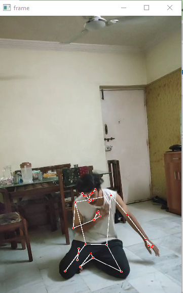
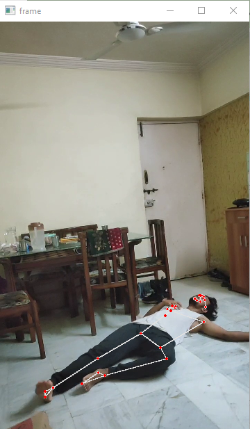

# Action Recognition using LSTM
In this project actions like walking, falling and waving are detected from videos.The project is made as a solution to detect situations like fights or people fainting in day to day like. The model used is LSTM to train on sequential frames in videos. Each video sample taken is about 1-2 seconds from which each video 30 frames are extracted. Dataset is created manually which includes me ( i wont be uploading that XD ) but you can find the dataset file

